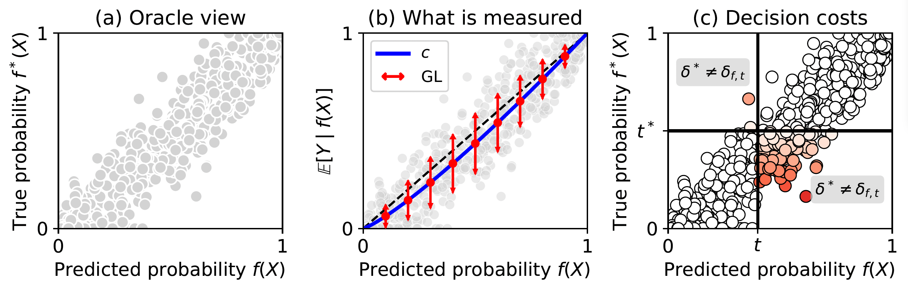

<h1>Epistemic Uncertainty Quantification to Improve Decisions from Black Box Models</h1>

    <a target='_blank'>Sébastien Melo</a>1&emsp;
    <a href='https://gael-varoquaux.info/' target='_blank'>Gaël Varoquaux</a>1,2&emsp;
    <a href='https://marinelm.github.io/' target='_blank'>Marine le Morvan</a>1&emsp;

 

    1Soda team, Inria Saclay, Palaiseau, France&emsp; 
    2:probabl., Paris, France&emsp; 

 

 

Our paper introduces a novel estimator of epistemic uncertainty in confidence scores that reveals local miscalibration and supports improved decision-making and more efficient LLM cascades.

### Abstract
> _Distinguishing epistemic uncertainty (model ignorance) from aleatoric uncertainty (task randomness) is critical for reliable AI systems, yet standard confidence evaluation metrics capture different and incomplete aspects of uncertainty. While AUC and accuracy measure predictive signal, proper scoring rules assess overall uncertainty, and calibration metrics isolate part of the epistemic uncertainty but ignore within-bin heterogeneity of errors, known as grouping loss. We bridge this evaluation gap by introducing asymptotically consistent and sample-efficient estimators of the grouping loss and excess risk, %, i.e. suboptimality of a prediction.
providing a fine-grained assessment of epistemic uncertainty that complements existing calibration metrics. Applied to LLM question-answering with inherent aleatoric noise, our estimators reveal substantial grouping loss which decreases with model scale and instruction tuning. Their local nature enables automatic identification of subgroups with systematic over- or under-confidence, supporting interpretable confidence audits. Finally, we leverage these estimates to design LLM cascades that defer high excess risk predictions to stronger models, achieving higher accuracy at lower cost than competing approaches._

This repository reproduces the results of the paper

## User-friendly package for estimating the grouping loss and epistemic risk
A separate package to easily estimate the grouping loss and epistemic risk of a classifier is available at:  

The code is coming soon.
